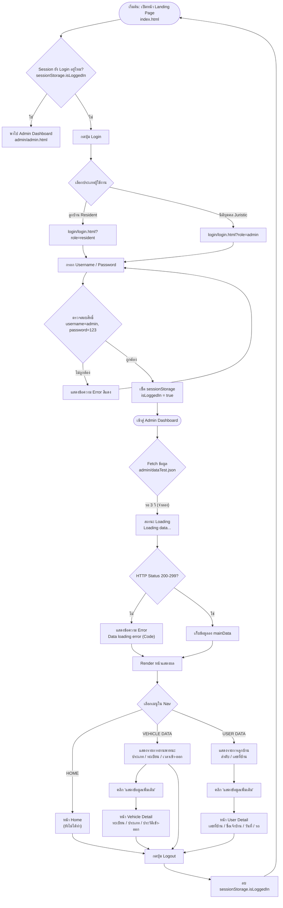
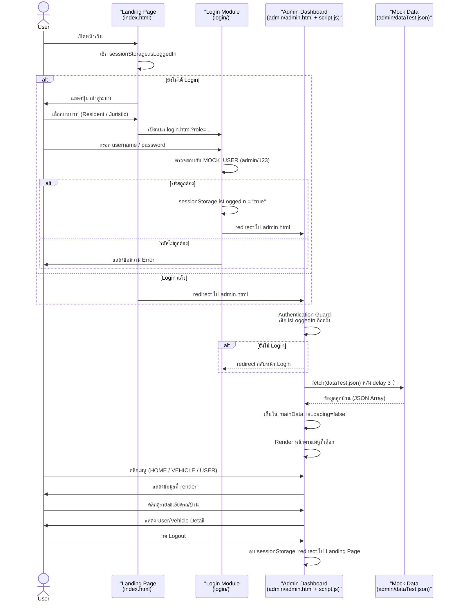
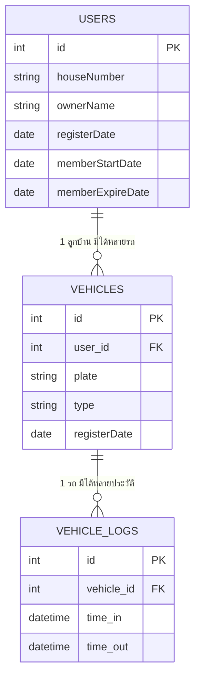

# Software Diagram - Smart Village VCCES System

## 1. System Flowchart (ผังการทำงานหลักของระบบ)

## 2. Sequence Diagram (ลำดับการทำงานของระบบ)

## 3. ER Diagram (โครงสร้างฐานข้อมูลที่วางแผนไว้)

